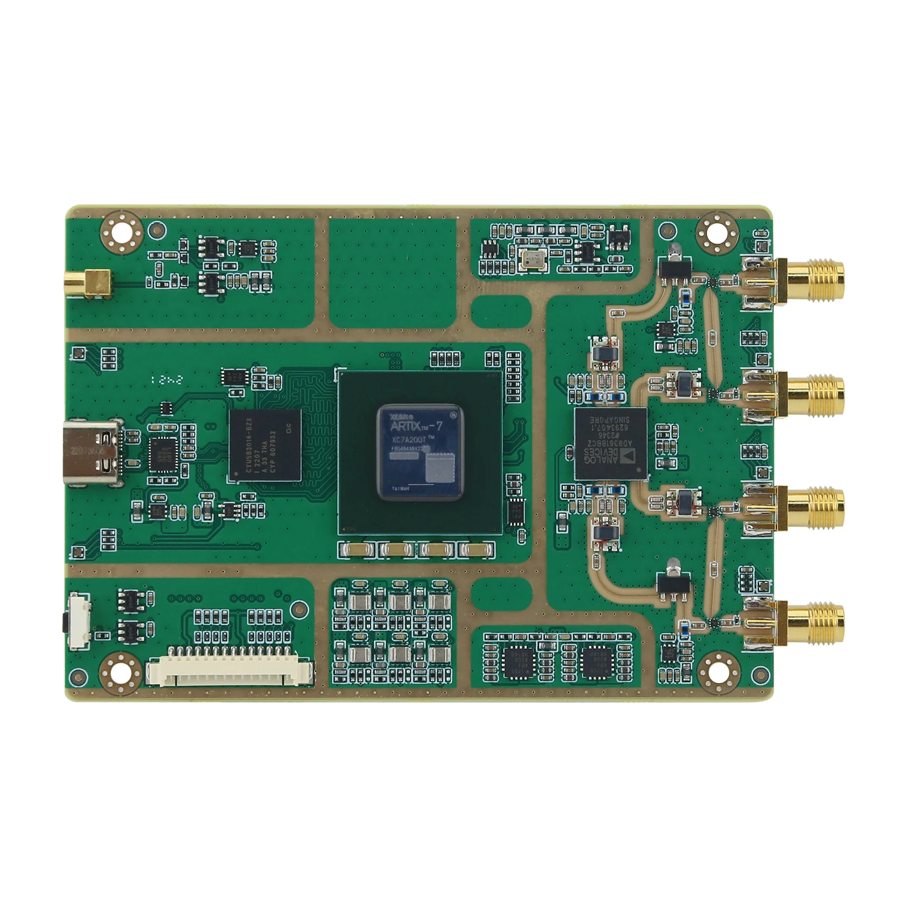
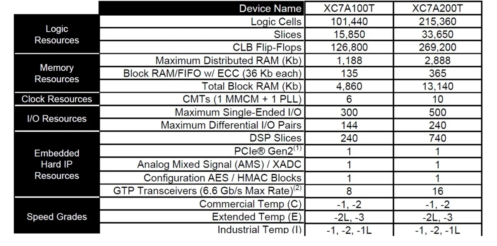
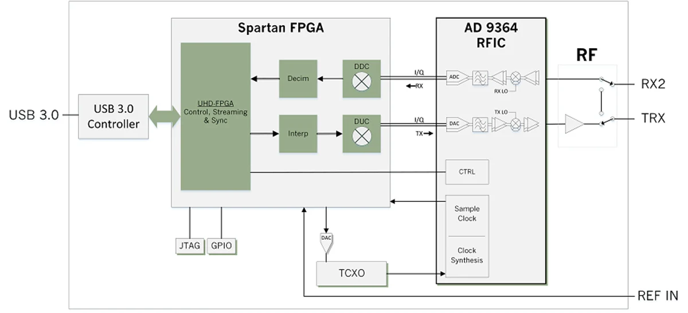

# LibreSDR_UHD_B220_Mini_FPGA
Updated FPGA source code and binaries for UHD B220 Clone with XC7A200T+AD9361

Compile/Build using Vivado v.2025.1 and Ubuntu 24.04 LTS

After compilation, copy src/libresdr_b210.runs/impl_1/libresdr_b210.bin to /opt/libresdr_b210.bin , adapt the serial number in uhd.conf to your device and copy the uhd.conf to your ~/.config/uhd.conf or /etc/uhd/uhd.conf. 

You can also rename the libresdr_b210.bin to usrp_b210_fpga.bin and run uhd_usrp_probe in the same folder.

